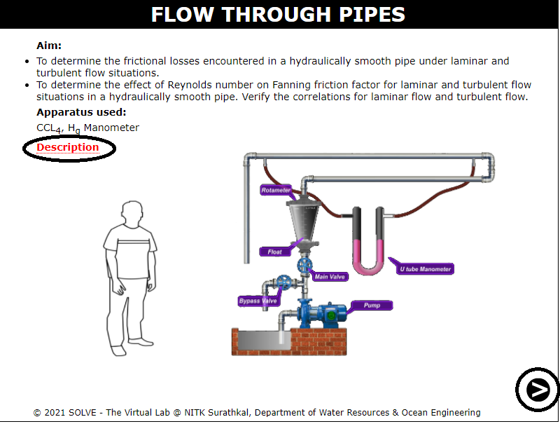
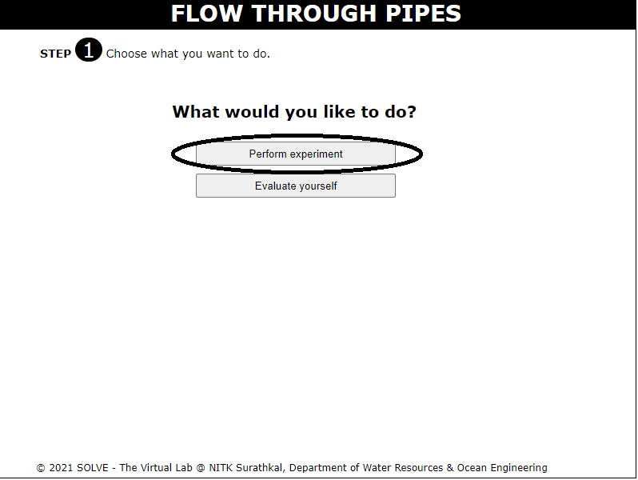
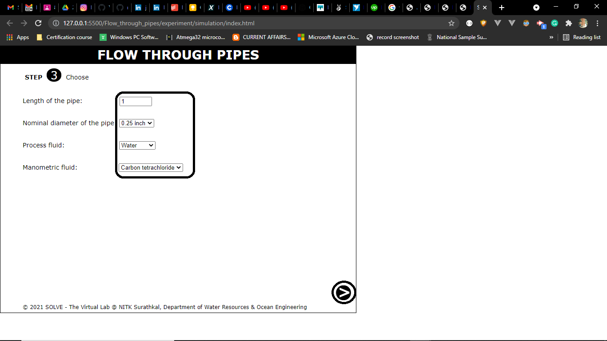
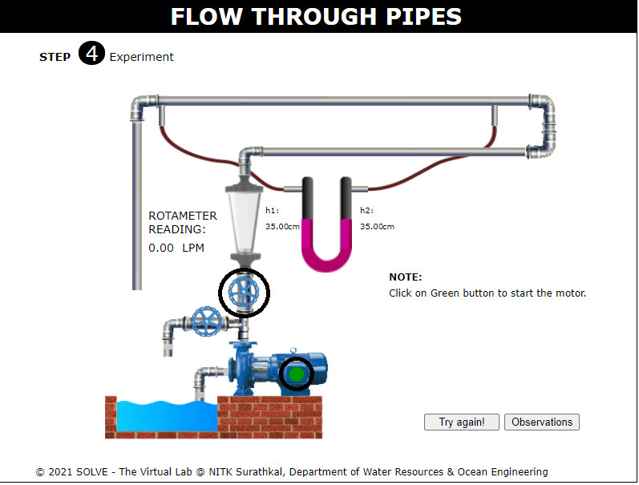
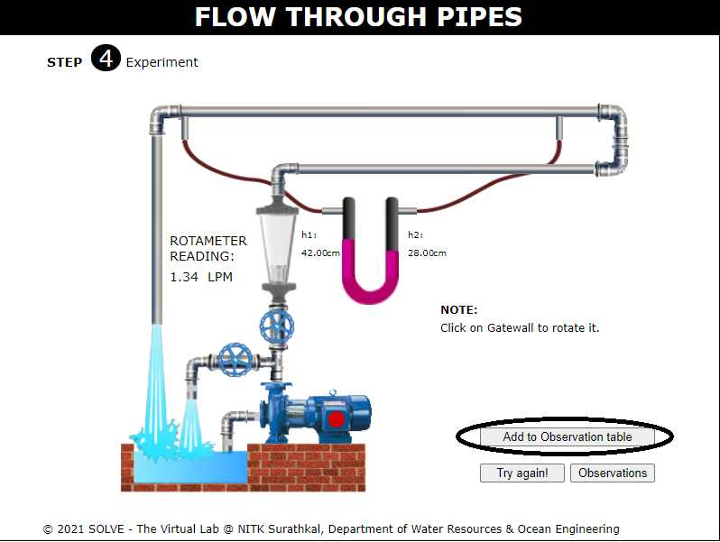
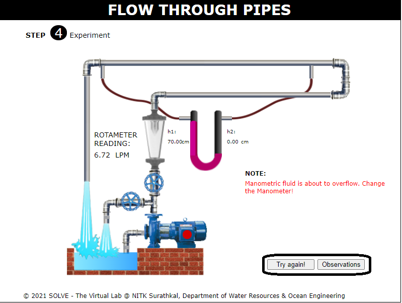
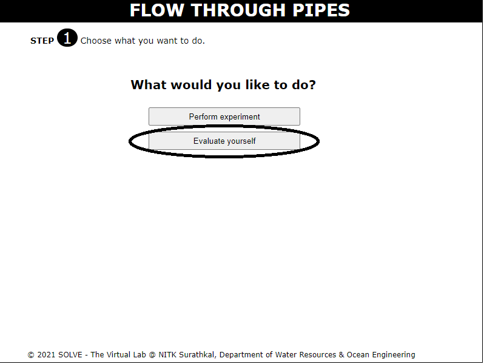
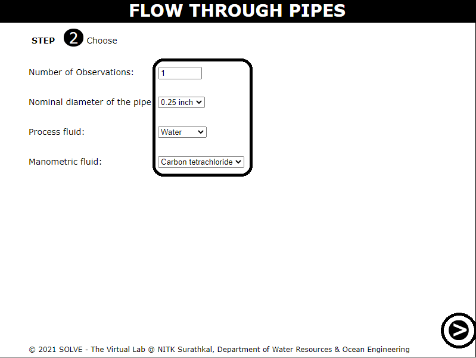
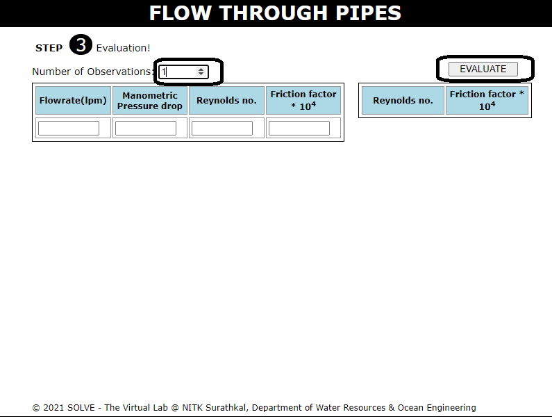

#### These procedure steps will be followed on the simulator

#### Flow through pipes:

1. Once the experiment is opened, click on the Description to understand the terminologies related to the experiment. Click on Next to proceed. 
 

2. Click on "Experiment" tab to perform the experiment. 
 

3. Choose the values and click on the NEXT button to go to the experiment. 
 

4. To start the experiment first Switch On the pump by clicking the GREEN button on the pump and to set the Required flow rate click on Main valve. 
 

5. Click on the "Add to observation table" to add the experiment values to the observation table. 
 

6. Click on the "Try again" to perform the experiment again. Click on "Observations" to go to the observation table. 
 

7. To evaluate experiment, click on "Evaluate yourself".  
 

8. Choose from the given data and click on NEXT button.  
 

9. Choose the number of observations, input the data and click on "Evaluate" to start the evaluation. 
 