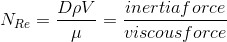
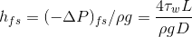
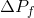
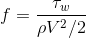
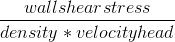
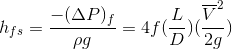
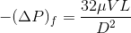

### INTRODUCTION 

### Flow through pipes :

Pipe flow under pressure is used for a lot of purposes. A fundamental understanding of fluid flow is essential to almost every industry related to chemical engineering. In the chemical and manufacturing industries, large flow networks are necessary to achieve continuous transport of products and raw materials from different processing units. This requires a detailed understanding of fluid flow in pipes. Energy input to the gas or liquid is needed to make it flow through the pipe. This energy input is needed because there is frictional energy loss (also called frictional head loss or frictional pressure drop) due to the friction between the fluid and the pipe wall and internal friction within the fluid. In pipe flow substantial energy is lost due to frictional resistances.

One of the most common problems in fluid mechanics is the estimation of this pressure loss. Calculating pressure losses is necessary for determining the appropriate size pump. Knowledge of the magnitude of frictional losses is of great importance because it determines the power requirements of the pump forcing the fluid through the pipe. For example, in refining and petrochemical industries, these losses have to be calculated accurately to determine where booster pumps have to be placed when pumping crude oil or other fluids in pipes to distances thousands of kilometres away.

Pipe losses in a piping system result from a number of system characteristics, which include among others; pipe friction, changes in direction of flow, obstructions in flow path, and sudden or gradual changes in the cross-section and shape of flow path.

In this experiment, pressure loss measurements are made as a function of flowrate on different pipe components, namely; a) straight pipe, (b)globe valve (c) o gate valve (d)an Expander (e)Reducer (f)standard elbow (g) 90 Bend.

#### Resistance to flow in a pipe

When a fluid flows through a pipe, the internal roughness of the pipe wall can create local eddy currents within the fluid adding a resistance to flow of the fluid. The velocity profile in a pipe will show that the fluid elements in the center of the pipe will move at a higher speed than those closer to the wall. . Therefore friction will occur between layers within the fluid. This movement of fluid elements relative to each other is associated with pressure drop, called frictional losses. Pipes with smooth walls such as glass, copper, brass and polyethylene have only a small effect on the frictional resistance. Pipes with less smooth walls such as concrete, cast iron and steel will create larger eddy currents which will sometimes have a significant effect on the frictional resistance. Rougher the inner wall of the pipe, more will be the pressure loss due to friction.

As the average velocity increases, pressure losses increase. Velocity is directly related to flow rate.
 
Velocity=Volumetric flow rate /Cross sectional area of the pipe.

An increase or decrease in flow rate will result in a corresponding increase or decrease in velocity. Smaller pipe causes a greater proportion of the liquid to be in contact with the pipe, which creates friction. Pipe size also affects velocity. Given a constant flow rate, decreasing pipe size increases the velocity, which increases friction. The friction losses are cumulative as the fluid travels through the length of pipe. The greater the distance, the greater the friction losses will be. Fluids with a high viscosity will flow more slowly and will generally not support eddy currents and therefore the internal roughness of the pipe will have no effect on the frictional resistance. This condition is known as laminar flow.

There are in general three types of fluid flow in pipes

<ul>
  <li>
    Laminar
  </li>
  <li>
    Turbulent
  </li>
  <li>
    Transient
  </li>
</ul>

#### Laminar flow

Laminar flow generally happens when dealing with small pipes , low flow velocities and with highly viscous fluids. At low velocities fluids tend to flow without lateral mixing,and adjacent layers slide past one another like playing cards. There are neither cross currents nor eddies. Laminar flow can be regarded as a series of liquid cylinders in the pipe, where the innermost parts flow the fastest, and the cylinder touching the pipe isn't moving at all.

#### Turbulent flow

In turbulent flow, the fluid moves erratically in the form of cross currents and eddies. Turbulent flow happens in general at high flow rates and with larger pipes.

#### Transitional flow

Transitional flow is a mixture of laminar and turbulent flow, with turbulence in the center of the pipe, and laminar flow near the edges.

 

Each of these flows behave in different manners in terms of their frictional energy loss while flowing, and have different equations that predict their behavior.Reynolds studied the conditions under which one type of flow changes into the other and found that the critical velocity ,at which laminar flow changes into turbulent flow ,depends on four quantities: the diameter of the tube, viscosity, density and average velocity of the liquid. He found that these four factors can be combined into one group and that the change in kind of flow occurs at a definite value of the group. The grouping of the variables so found was Reynolds Number() .Turbulent or laminar flow is determined by Reynolds Number.

 

The Reynolds number expresses the ratio of inertial (resistant to change or motion) forces to viscous forces.

</img>

Where,

D is the diameter of the pipe

<!-- 

    

        </img>   
    

    

        
 is the density of fluid

    

 -->

ρ is the density of fluid

V is the average velocity of the fluid

μ is the viscosity of fluid
  

    The Reynolds number can be written in terms of kinematic viscosity ( η )

    η = dynamic viscosity / density = μ / ρ

 

    The Reynolds number is important in analyzing any type of flow when there is substantial velocity gradient (i.e. shear.) It indicates the relative significance of the viscous effect compared to the inertia effect.

The flow is

<ul>
  <li>
    Laminar when NRe < 2100
  </li>
  <li>
    Turbulent transient when 2100 < NRe < 4000
  </li>
  <li>
    Transient turbulent when 4000 < NRe
  </li>
</ul>

    At the laminar region,viscous forces are dominant as compared to inertial forces. Under laminar flow condition the pressure drop per unit length is proportional to the velocity. At the transition region, the experimental results are not reproducible. Finally, at turbulent regions, inertial forces are dominant. For turbulent flow, the pressure drop becomes proportional to the velocity raised to a power of 2.

 

#### Relationship Between Frictional Head Loss and Frictional Pressure Drop

    The energy loss in pipe flow due to friction can be expressed as a pressure drop instead of as a head loss. Chemical and mechanical engineers often work with pressure drop, whereas civil engineers usually work with head loss. The relationship between frictional head loss and frictional pressure drop is simply:

    (-△P)f = ρghfs

    Where:

    (-△P)f = ρghfs = frictional pressure drop 

    hfs = frictional head loss due to skin friction 

    ρ = fluid density 

    g = acceleration due to gravity 

 

    Head Loss due to skin friction (hfs) can be related to wall shear. 

</img>

    Where </img>  is the shear stress at the wall of the pipe ,L is the length of the pipe and
    </img>  is pressure drop due to friction losses.  
    </img> is not conveniently determined so the dimensionless friction factor is introduced into the equations.

    The Friction Factor It is denoted by f and defined as the ratio of the wall shear stress to the product of the velocity head (V2/2) and density = 

</img>

    </img> </img> 

Where f is the Fanning's friction factor

<ul>
  <li>
    Only need L, D, V and f to get friction loss
  </li>
  <li>
    Valid for both laminar and turbulent flow
  </li>
  <li>
    Valid for Newtonian and Non-Newtonian fluids
  </li>
</ul>

    Correlations were made between the fanning friction factor and the Reynolds number for both laminar and turbulent flow in a variety of pipes.

    For laminar flow, first principles can be used to develop a relation between Reynolds number and friction factor. The Hagen-Poiseuille equation relates the frictional pressure drop to fluid velocity, viscosity, and pipe dimension:

</img>

    Equating the pressure drop due to friction in the Hagen-Poiseuille equation given by Eq.8, with the overall pressure drop across the pipe, and combining with the Fanning equation given by Eq.7, results in relation for laminar flow as

    
    f=16/NRe        (9) 

#### Relevant Indian Standard for Specific Gravity on Cement :
1. IS 4031 (Part II) – 1988: Methods of Physical Tests for Hydraulic Cement, Reaffirmed 2002. 

### Specific Gravity of Fine Aggregates :

The aggregate passing through 4.75mm sieve size is called as fine aggregate. Natural sand is generally used as fine aggregate, silt and clay are also come under this category. IS specifications classify the fine aggregate into four types according to its grading as fine aggregate of grading Zone-1 to grading Zone-4. The four grading zones become progressively finer from grading Zone-1 to grading Zone-4. 90% to 100% of the fine aggregate passes 4.75 mm IS sieve and 0 to 15% passes 150 micron IS sieve depending upon its grading zone. The purpose of using fine aggregate in concrete is to fill the voids in the coarse aggregate and to act as a workability agent.

 Fine aggregate |   Size variation
:---:|:---:
Coarse Sand | 2.0mm - 0.5mm
Medium sand |	0.5mm - 0.25mm
Fine sand |	0.25mm - 0.06mm
Silt |	0.06mm - 0.002mm
Clay |	< 0.002

The fine aggregate Specific Gravity test is used to calculate the Specific Gravity of a sample by determining the ratio of the weight of a given volume of aggregate to the weight of an equal volume of water. Aggregate Specific Gravity is used in a number of applications including in mix design, deleterious particle identification and separation, and material property change identification etc. Generally the material's weight is typically measured and then converted to a volume based on its Specific Gravity. Correct and accurate material Specific Gravity determinations are vital to proper mix design. An incorrect Specific Gravity value will result in incorrectly calculated volumes and ultimately result in an incorrect mix design. Specific Gravity can also indicate possible material contamination, large amount of deleterious material in an aggregate sample may result in an abnormally low Specific Gravity. Specific Gravity differences can be used to indicate a possible material change. A change in aggregate mineral or physical properties can result in a change in Specific Gravity.

Specific Gravity of Fine Aggregate,

Where,

W1= weight of the empty flask

W2= weight of the flask + 1/3rd of fine aggregate

W3=weight of the flask+1/3rd aggregate+ water

W4= weight of the flask+ water

#### Relevant Indian Standard:
1. IS:2386 (PartIII)-1963: Methods of Test for Aggregates for Concrete. 

### Specific Gravity of Coarse Aggregates :

Aggregates are the important constituents in concrete. They give body to the concrete, reduce shrinkage and effect economy. Normally, aggregates come from a stockpile stored outside and thus contain varying amounts of water, depending on recent rainfall, outside temperatures, relative humidity and so forth. However, in the normal mix design procedure, aggregate weights will be based on a saturated surface-dry (SSD) condition or on an oven-dry (OD) condition. Specific gravities of both fine and coarse aggregates may be calculated for either moisture conditions. When the aggregate is sieved through 4.75mm sieve, the aggregate retained is called coarse aggregate. Gravel, cobble and boulders come under this category. In general, 40mm size aggregate used for normal strengths and 20mm size is used for high strength concrete.

Coarse aggregate |   Size variation
:---:|:---:
Fine gravel |	4mm - 8mm
Medium gravel |	8mm - 16mm
Coarse gravel |	16mm - 64mm
Cobbles |	64mm - 256mm
Boulders |	> 256mm

Each material added to the concrete mix has a particular weight (excluding air) and a particular solid volume (including air). The relationship between the weight and the solid volume for any material depends on the Specific Gravity of that material. Specific Gravity, which is related to the material’s density, is the weight of the material divided by the weight of an equal volume of water. Each individual particle of aggregate consists of solid matter and pores, and the pores may or may not contain water. Because the aggregate weight will vary depending on the amount of moisture in these pores and on the aggregate particle surface, Specific Gravity will be determined at fixed moisture content. It can be measured by using pycnometer or wire basket method. Finally the ratio of weight of an aggregate to the equal weight of water will give the Specific Gravity of that aggregate.

Specific Gravity of Coarse Aggregate,

Where,

W1= weight of the empty flask

W2= weight of the flask + 1/3rd of coarse aggregate

W3=weight of the flask+1/3rd aggregate+ water

W4= weight of the flask+ water

</img> 
Section of Pyconometer 
( Source: IS 2386 (Part III) - 1963 )

#### Relevant Indian Standard :
1. IS 2386 (Part III) -1963: Methods of Test for Aggregates for Concrete, Reaffirmed 2002.  
